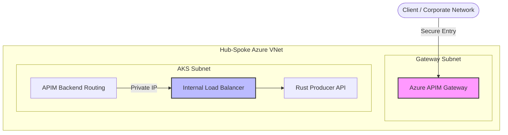

## 🛠️ Deployment Lifecycle

### 0. Prerequisites & Environment Variables

```bash
# --- Core Identifiers ---
export LOCATION="eastus2"
export RESOURCE_GROUP="XXXXXX"
export SUBSCRIPTION_ID="XXXXXX"
export AKS_NAME="aks-ocr-cluster"
export ACR_NAME="acrocrinference"
```

### 🔑 Authenticate Azure CLI Session

Before proceeding, ensure your Azure CLI session is authenticated and set to the correct subscription. This step is required for all subsequent resource creation commands.

```bash
az login
az account set --subscription "$SUBSCRIPTION_ID"
az account show --output table
```

> Expected: Your intended subscription shows as `IsDefault = True` (or at least matches `$SUBSCRIPTION_ID`).

### 1. Infrastructure Setup: AKS & Storage

```bash
# 1. Create the container registry
az acr create -g $RESOURCE_GROUP -n $ACR_NAME --sku Premium --location $LOCATION

# 2. Download ACR credentials
az acr login --name $ACR_NAME

# 3. Create AKS Cluster
az aks create \
  --resource-group $RESOURCE_GROUP \
  --location $LOCATION \
  --name $AKS_NAME \
  --attach-acr $ACR_NAME \
  --node-count 1 \
  --enable-managed-identity \
  --enable-blob-driver \
  --generate-ssh-keys

# 4. Downlaod AKS credentials
az aks get-credentials \
  --resource-group $RESOURCE_GROUP \
  --name $AKS_NAME

# 5. GPU Node Pool (A100 80GB)
az aks nodepool add \
  --resource-group $RESOURCE_GROUP \
  --cluster-name $AKS_NAME \
  --name gpunpa100 \
  --node-vm-size Standard_NC24ads_A100_v4 \
  --node-count 1 \
  --enable-cluster-autoscaler \
  --min-count 0 \
  --max-count 4 \
  --node-taints sku=gpunpa100:NoSchedule \
  --tags EnableManagedGPUExperience=true \
  --gpu-driver none

# 6. GPU Node Pool (T4 16GB)
az aks nodepool add \
  --resource-group $RESOURCE_GROUP \
  --cluster-name $AKS_NAME \
  --name gpunpt4 \
  --node-vm-size Standard_NC16as_T4_v3 \
  --node-count 1 \
  --enable-cluster-autoscaler \
  --min-count 0 \
  --max-count 4 \
  --node-taints sku=gpunpt4:NoSchedule \
  --tags EnableManagedGPUExperience=true \
  --gpu-driver none

# 7. High-Memory CPU Node Pool (Redis)
az aks nodepool add \
  --resource-group $RESOURCE_GROUP \
  --cluster-name $AKS_NAME \
  --name redisnp \
  --node-vm-size Standard_E4ds_v5 \
  --node-count 1 \
  --enable-cluster-autoscaler \
  --min-count 1 \
  --max-count 3 \
  --node-taints sku=redis:NoSchedule \
  --labels app=redis-store

# 8. CPU-Optimized Node Pool (API Gateway)
az aks nodepool add \
  --resource-group $RESOURCE_GROUP \
  --cluster-name $AKS_NAME \
  --name apinp \
  --node-vm-size Standard_DS2_v2 \
  --node-count 1 \
  --enable-cluster-autoscaler \
  --min-count 1 \
  --max-count 5 \
  --node-taints sku=api:NoSchedule \
  --labels app=api-gateway
```

#### 🛡️ GPU Lifecycle: Operator, PSA & Taint-Tolerations

Modern AKS clusters (v1.25+) enforce **Pod Security Admission (PSA)**. Because the GPU Operator must load kernel modules and access `/dev/` directly, it requires the `privileged` security profile. Additionally, since our GPU nodes are tainted with `sku=gpu:NoSchedule`, we must tell the Operator to tolerate that taint.

```bash
# 1. Add the Helm repo
helm repo add nvidia https://helm.ngc.nvidia.com/nvidia
helm repo update

# 2. Create the namespace & Label it for PSA (CRITICAL)
# Without this label, the Operator pods will be blocked from starting.
kubectl create namespace gpu-operator
kubectl label --overwrite ns gpu-operator pod-security.kubernetes.io/enforce=privileged

# 3. Install the GPU Operator with Taint-Toleration Values
helm install gpu-operator nvidia/gpu-operator \
  -n gpu-operator \
  -f k8s/aks/infra/gpu-operator-values.yaml
```

**Wait for rollout (3-5 mins):**
```bash
# Wait for the Driver (kernel module compilation)
kubectl -n gpu-operator rollout status ds/nvidia-driver-daemonset --timeout=10m
# Wait for Device Plugin (reports 'nvidia.com/gpu' capacity)
kubectl -n gpu-operator rollout status ds/nvidia-device-plugin-daemonset
kubectl -n gpu-operator rollout status ds/gpu-feature-discovery
```

#### 🔍 Verify GPU Schedulability
To ensure the GPU Operator has correctly labeled the nodes and the `nvidia.com/gpu` resource is available for your pods, run the following commands:

```bash
# 1. Check GPU Capacity & Allocatable (Summary Table)
# This is the fastest way to see if your cluster is "GPU-ready".
kubectl get nodes "-o=custom-columns=NAME:.metadata.name,GPU_CAPACITY:.status.capacity.nvidia\.com/gpu,GPU_ALLOCATABLE:.status.allocatable.nvidia\.com/gpu"

# 2. Detailed GPU Resource Check (Filtered Describe)
# Useful for finding which specific node is failing to report GPUs.
# On Linux:
kubectl describe nodes | grep -A 5 "Allocatable" | grep "nvidia.com/gpu"
# On Windows (PowerShell):
kubectl describe nodes | Select-String "nvidia.com/gpu" -Context 0,5

# 3. Verify GPU Operator Health (In gpu-operator namespace)
# Ensure all pods are 'Running' and 'Completed'
kubectl get pods -n gpu-operator

# 4. Check for Taint/Toleration Mismatches
# If nodes have GPUs but pods won't schedule, check for the 'sku=gpu:NoSchedule' taint.
kubectl describe nodes | Select-String "Taints" -Context 0,2
```

> **Pro Tip:** If `GPU_ALLOCATABLE` shows `0` or `<none>`, the GPU Operator components (Drivers/Device Plugin) have failed to schedule on those nodes. Re-check the tolerations in `k8s/infra/gpu-operator-values.yaml` and ensure the `gpu-operator` namespace has the `privileged` PSA label.

### 📦 2. Model Ingestion: Datacenter‑to‑Datacenter

At EMDI, we treat models as **heavy data**, not as code. Instead of downloading ~100GB locally only to re-upload it later, we perform an **in-cluster ingestion** using a Kubernetes **Job**.

This Job downloads the weights directly from Hugging Face to a persistent volume (PVC) backed by Azure Blob. Once completed, the models are available for all inference pods without repeated downloads.

#### 2.1 Provision Storage (PVC)

The model weights are stored in a **Blob CSI‑backed PVC**. This must exist and be bound before launching the Job.

```bash
# 1. Apply the PVC
kubectl apply -f k8s/aks/infra/provisioning/pvc.yaml

# 2. Verify the status is 'Bound'
kubectl get pvc model-weights-pvc
```

**Expected Output:**
```text
NAME                STATUS   VOLUME                                     CAPACITY   ACCESS MODES   STORAGECLASS             AGE
model-weights-pvc   Bound    pvc-37837be3-65b2-4cf0-b6ce-f7fe61b13adb   300Gi      RWX            azureblob-fuse-premium   29s
```

#### 2.2 Launch the Ingestion Job

The Job uses environment variables to manage parallel downloads.

```bash
# Launch the job
kubectl apply -f k8s/aks/infra/provisioning/ingest-job.yaml

# Confirm creation and detailed status
kubectl get job model-weight-ingest
kubectl describe job model-weight-ingest
```

#### 2.3 Observe Progress

Do not use manual Pod names; use the Job abstraction to follow the download logs from Hugging Face:

```bash
kubectl logs -f job/model-weight-ingest
```

*(Once you see the message `✅ Ingestion complete`, you can clean up the job with `kubectl delete job model-weight-ingest`)*


#### 2.4 Debugging & Manual Inspection (Optional)

If you need to manually verify the integrity of the downloaded `.safetensors` files, launch this debugging pod:

```bash
kubectl run weights-debug \
  --rm -it \
  --image=ubuntu:22.04 \
  --overrides='
{
  "spec": {
    "containers": [{
      "name": "debug",
      "image": "ubuntu:22.04",
      "command": ["bash"],
      "stdin": true,
      "tty": true,
      "volumeMounts": [{
        "name": "weights",
        "mountPath": "/mnt/models"
      }]
    }],
    "volumes": [{
      "name": "weights",
      "persistentVolumeClaim": {
        "claimName": "model-weights-pvc"
      }
    }]
  }
}'
```

*Inside the pod, you can inspect the models:*
```bash
cd /mnt/models
ls -lhR
exit
```

The expected output will be something like this:

```bash
root@weights-debug:/mnt/models# ls -lhR
.:
total 0
drwxrwxrwx 2 root root 4.0K May 22 22:10 Qwen

./Qwen:
total 0
drwxrwxrwx 2 root root 4.0K May 22 22:10 Qwen3-VL-Embedding-2B
drwxrwxrwx 2 root root 4.0K May 22 22:11 Qwen3.5-4B

./Qwen/Qwen3-VL-Embedding-2B:
total 0
-rwxrwxrwx 1 root root 4.0G May 22 22:11 model.safetensors
-rwxrwxrwx 1 root root 1.6K May 22 22:10 config.json
-rwxrwxrwx 1 root root  11M May 22 22:11 tokenizer.json
-rwxrwxrwx 1 root root 5.3K May 22 22:11 tokenizer_config.json

./Qwen/Qwen3.5-4B:
total 0
-rwxrwxrwx 1 root root  12K May 22 22:11 LICENSE
-rwxrwxrwx 1 root root  76K May 22 22:11 README.md
-rwxrwxrwx 1 root root 7.6K May 22 22:11 chat_template.jinja
-rwxrwxrwx 1 root root 3.1K May 22 22:11 config.json
-rwxrwxrwx 1 root root 3.2M May 22 22:11 merges.txt
-rwxrwxrwx 1 root root 5.0G May 22 22:11 model.safetensors-00001-of-00002.safetensors
-rwxrwxrwx 1 root root 3.8G May 22 22:12 model.safetensors-00002-of-00002.safetensors
-rwxrwxrwx 1 root root  75K May 22 22:12 model.safetensors.index.json
-rwxrwxrwx 1 root root  390 May 22 22:12 preprocessor_config.json
-rwxrwxrwx 1 root root  13M May 22 22:12 tokenizer.json
-rwxrwxrwx 1 root root  17K May 22 22:12 tokenizer_config.json
-rwxrwxrwx 1 root root  385 May 22 22:12 video_preprocessor_config.json
-rwxrwxrwx 1 root root 6.5M May 22 22:12 vocab.json
```

### 3. Build & Push

```bash
az acr login --name $ACR_NAME

# 1. The vLLM Server (Qwen 3.5 4B Model Weights + Inference Engine)
az acr build --registry $ACR_NAME --image ocr-vlm-qwen:latest ./server

# 2. Real-Time Architecture (Enterprise Agentic Flow)
# Build the high-performance Rust Producer (API Gateway)
az acr build --registry $ACR_NAME --image ocr-api-rust:latest ./client_rt_producer
# Build the GPU-ready Python Consumer (Layout Engine)
az acr build --registry $ACR_NAME --image ocr-worker-rt:latest ./client_rt_consumer
```

### 4. Deploy the Full Stack

```bash
# 1. Install KEDA
helm repo add kedacore https://kedacore.github.io/charts
helm upgrade --install keda kedacore/keda -n keda --create-namespace

# 2. Install Prometheus Stack (Required for Real-time Scaling)
helm repo add prometheus-community https://prometheus-community.github.io/helm-charts
helm repo update

kubectl create namespace monitoring
helm install prometheus prometheus-community/kube-prometheus-stack \
  --namespace monitoring \
  --set prometheus.prometheusSpec.serviceMonitorSelectorNilUsesHelmValues=false \
  --set grafana.enabled=true

# 3. Deploy Real-Time Architecture
kubectl apply -k k8s/aks/
```

### 5. End-to-End Testing & Validation

#### Inspect Logs (Debug Nodepools)
To ensure each component is running correctly, you can tail the logs for each specific node pool:

```bash
# 1. Producer API (redisnp) - Rust Gateway
kubectl logs -l app=ocr-api --tail=100 -f

# 2. Consumer Worker (gpunpt4) - Layout Detection (T4)
kubectl logs -l app=ocr-worker-rt --tail=100 -f

# 3. vLLM Server (gpunpa100) - Qwen 3.5 4B Inference (A100)
kubectl logs -l app=ocr-vlm --tail=100 -f
```

#### Verify Metrics & Scaling
Check if the metrics are flowing to Prometheus (it may take 2-3 minutes for the first scrape):
```bash
# Check T4 GPU Utilization
kubectl exec -it -n monitoring prometheus-prometheus-0 -- \
  promtool query instant http://localhost:9090 "avg(DCGM_FI_DEV_GPU_UTIL)"

# Check A100 vLLM Waiting Requests
kubectl exec -it -n monitoring prometheus-prometheus-0 -- \
  promtool query instant http://localhost:9090 "sum(vllm:num_requests_waiting)"
```

### 6. Enterprise Exposure: Azure API Management (APIM)

For enterprise-grade deployments, exposing the service via a public IP is not recommended. Instead, we use **Azure API Management (APIM)** in **Internal VNet mode** to provide a secure, governed, and rate-limited entry point.

#### 🛡️ Architecture & Security: Why APIM + VNet Isolation?

By default, exposing Kubernetes services to the public internet using Public IP LoadBalancers introduces security vulnerabilities (DDoS, brute-force requests, unauthorized model consumption) and financial risk (runaway node scaling via KEDA). To build a zero-trust network perimeter around the OCR pipeline, we employ a multi-layered security design:



##### Core Isolation Components:

1. **Private Load Balancing**: The annotation `service.beta.kubernetes.io/azure-load-balancer-internal: "true"` instructs Azure to provision the AKS LoadBalancer in the private cluster subnet rather than assigning a public-facing IP.
2. **Private API Gateways**:
   - **Internal VNet Mode (Recommended for Internal-only APIs)**: APIM is deployed in a dedicated subnet inside the AKS virtual network. It has no public IP and is strictly accessible via **VNet Peering**, **Azure VPN Gateway (P2S/S2S)**, or **ExpressRoute**. This completely prevents any internet exposure.
   - **External VNet Mode (Secure Public Access)**: If the API must be consumed by external clients directly over the internet, APIM is provisioned in External VNet mode. It gets a public IP but serves as a strict gateway where all traffic is validated, filtered, and throttled before passing into the private AKS subnet.
3. **Defense-in-Depth with Azure Application Gateway & WAF**:
   For maximum security, you can chain **Azure Application Gateway** (with Web Application Firewall - WAF) in front of the internal APIM instance. The Application Gateway handles SSL termination and WAF rules (mitigating OWASP Top 10 vulnerabilities), while APIM handles rate-limiting, authentication, and backend routing.


#### 1. Configure Internal Load Balancer
Ensure the AKS service is configured as an **Internal Load Balancer** so it only has a private IP within the VNet. 

**Network Discovery:**
Before provisioning APIM, use these commands to find the exact networking details managed by AKS:
```bash
# 1. Find the Node Resource Group (where AKS networking lives)
NODE_RG=$(az aks show -g $RESOURCE_GROUP -n $AKS_NAME --query nodeResourceGroup -o tsv)

# 2. Find the VNet Name
VNET_NAME=$(az network vnet list -g $NODE_RG --query "[0].name" -o tsv)

# 3. List Subnets (Choose the one used by your AKS node pools)
az network vnet subnet list -g $NODE_RG --vnet-name $VNET_NAME --query "[].name" -o table
```

Update your `k8s/networking/service.yml` with the following annotation:

```yaml
metadata:
  annotations:
    service.beta.kubernetes.io/azure-load-balancer-internal: "true"
```

#### 2. Provision APIM in Internal Mode
Deploy an APIM instance (Developer or Premium tier) into the same VNet as your AKS cluster. This allows APIM to route traffic to the internal `ocr-api-service` IP without crossing the public internet.

```bash
# 1. Create the APIM Instance (Internal Mode)
# Replace <vnet-id> and <subnet-name> with your specific network details
az apim create \
  --name "apim-ocr-service" \
  --resource-group $RESOURCE_GROUP \
  --location $LOCATION \
  --publisher-email "admin@yourcompany.com" \
  --publisher-name "OCR Team" \
  --sku-name Developer \
  --virtual-network Internal \
  --vnet-id "/subscriptions/$SUBSCRIPTION_ID/resourceGroups/$RESOURCE_GROUP/providers/Microsoft.Network/virtualNetworks/<vnet-name>" \
  --subnet-name "<subnet-name>"

# 2. Wait for deployment (APIM can take 30-45 mins to provision)
```

#### 3. Define Backend & Security Policies
These commands configure APIM to act as the secure gateway for your internal AKS service.

**A. Define the Backend (The Internal AKS Service)**
```bash
# Get the internal IP of your service
INTERNAL_IP=$(kubectl get svc ocr-api-service -o jsonpath='{.status.loadBalancer.ingress[0].ip}')

az apim backend create \
  --resource-group $RESOURCE_GROUP \
  --service-name "apim-ocr-service" \
  --backend-id "ocr-api-backend" \
  --url "http://$INTERNAL_IP" \
  --protocol http
```

**B. Create the API & Operations**
```bash
az apim api create \
  --resource-group $RESOURCE_GROUP \
  --service-name "apim-ocr-service" \
  --api-id "ocr-api" \
  --path "ocr" \
  --display-name "High-Performance OCR API"

az apim api operation create \
  --resource-group $RESOURCE_GROUP \
  --service-name "apim-ocr-service" \
  --api-id "ocr-api" \
  --url-template "/process" \
  --method "POST" \
  --display-name "Process Document"
```

**C. Apply Governance Policies**
**Governance Note:** While vLLM and Workers are `ClusterIP` scope, throttling at the APIM layer provides **indirect protection** for GPU resources. By limiting the ingestion rate of the Producer API, we prevent abusive bursts from triggering unnecessary KEDA scale-out events on the expensive A100/T4 node pools.

```bash
# Apply the JWT and Rate-Limit policy
az apim api operation policy set \
  --resource-group $RESOURCE_GROUP \
  --service-name "apim-ocr-service" \
  --api-id "ocr-api" \
  --operation-id "post-process" \
  --policy-value "k8s/aks/networking/apim-policy.xml"
```

**D. Provision API Keys (Subscriptions)**
Group the API into a **Product** to enable **API Key (Subscription)** authentication. This is ideal for external partners or simple CLI usage.

```bash
# 1. Create a Product
az apim product create \
  --resource-group $RESOURCE_GROUP \
  --service-name "apim-ocr-service" \
  --product-id "ocr-partner-tier" \
  --display-name "OCR Partner Tier" \
  --subscription-required true \
  --state published

# 2. Add API to Product
az apim product api add \
  --resource-group $RESOURCE_GROUP \
  --service-name "apim-ocr-service" \
  --product-id "ocr-partner-tier" \
  --api-id "ocr-api"

# 3. Create a Subscription (Generates the API Key)
az apim subscription create \
  --resource-group $RESOURCE_GROUP \
  --service-name "apim-ocr-service" \
  --subscription-id "partner-abc-key" \
  --display-name "Partner ABC Subscription" \
  --product-id "ocr-partner-tier" \
  --state active

# 4. Retrieve the API Key
az apim subscription show \
  --resource-group $RESOURCE_GROUP \
  --service-name "apim-ocr-service" \
  --subscription-id "partner-abc-key" \
  --query primaryKey -o tsv
```

#### 4. Access Control & Extending Authorization

This deployment supports a **Hybrid Security Model**:

*   **Zero-Trust JWT**: Validates internal identities via Microsoft Entra ID. Use the `Authorization: Bearer <token>` header.
*   **API Key (Subscription)**: Provides access for external partners or simplified CLI use. Use the `Ocp-Apim-Subscription-Key: <key>` header.

**Governance Features:**
*   **Indirect GPU Protection**: Throttling occurs at the gateway. This prevents high-volume bursts from triggering expensive KEDA scale-out events on the A100/T4 nodes.
*   **Tiered Access**: By creating different **APIM Products**, you can assign different rate limits to different users (e.g., "Gold" partners get 500 calls/min, "Free" users get 10).

**Example Request with API Key:**
```bash
curl -X POST "https://apim-ocr-service.azure-api.net/ocr/process" \
     -H "Ocp-Apim-Subscription-Key: YOUR_API_KEY" \
     -F "file=@invoice.pdf"
```

### 6. Monitoring & Dashboards (Grafana)

To see the real-time scaling events and GPU utilization, you can access the Grafana dashboard:

1. **Port-forward the Grafana service**:
   ```bash
   kubectl port-forward -n monitoring svc/prometheus-grafana 3000:80
   ```
2. **Retrieve the admin password**:
   ```bash
   kubectl get secret -n monitoring prometheus-grafana -o jsonpath="{.data.admin-password}" | base64 --decode ; echo
   ```
3. **Access the UI**:
   - Open your browser to: `http://localhost:3000`
   - **Username**: `admin`
   - **Password**: (The string retrieved above)

#### Best practice: Scale to zero

As GPU clusters are the most expensive component of the stack, it's convenient to be cautious about their usage. Since we have the Cluster Autoscaler enabled, we scale to zero by updating the `min-count`:

```bash
az aks nodepool update \
  --resource-group $RESOURCE_GROUP \
  --cluster-name $AKS_NAME \
  --name gpunp \
  --update-cluster-autoscaler \
  --min-count 0 \
  --max-count 4
```

---

## 🔍 Monitoring & Resources
*   [PaddleOCR-VL 1.5 Pipeline Docs](https://www.paddleocr.ai/main/en/version3.x/pipeline_usage/PaddleOCR-VL.html)
*   [vLLM Inference Engine](https://docs.vllm.ai/)
*   [KEDA Azure Queue Scaler](https://keda.sh/docs/scalers/azure-queue/)
*   [HuggingFace: PaddleOCR-VL 1.5](https://huggingface.co/PaddlePaddle/PaddleOCR-VL-1.5)
*   [Azure AKS Shared GPU Guide](https://learn.microsoft.com/en-us/azure/aks/gpu-cluster)
