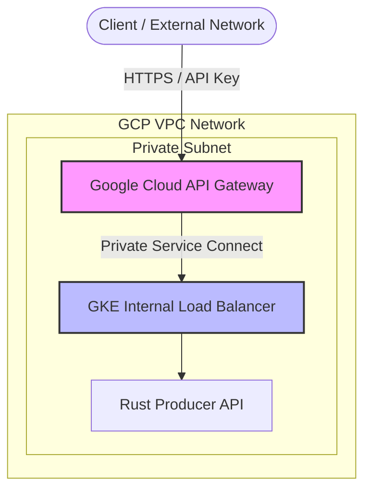

## 🛠️ Deployment Lifecycle (Google Kubernetes Engine - GKE)

### 0. Prerequisites & Environment Variables

```bash
# --- Core Identifiers ---
export LOCATION="us-central1"
export PROJECT_ID="your-gcp-project-id"
export GKE_CLUSTER_NAME="gke-ocr-cluster"
export AR_REPO_NAME="ocr-repository"
export AR_LOCATION="us-central1"
export AR_REGISTRY="${AR_LOCATION}-docker.pkg.dev/${PROJECT_ID}/${AR_REPO_NAME}"
```

### 🔑 Authenticate Google Cloud CLI Session

Before proceeding, ensure your Google Cloud CLI (`gcloud`) session is authenticated and set to your target project.

```bash
gcloud auth login
gcloud config set project "$PROJECT_ID"
gcloud config set compute/region "$LOCATION"
```

> Expected: `gcloud config get-value project` outputs `$PROJECT_ID`.

---

### 1. Infrastructure Setup: GKE & Storage

```bash
# 1. Create Google Cloud Artifact Registry Repository
gcloud artifacts repositories create $AR_REPO_NAME \
  --repository-format=docker \
  --location=$AR_LOCATION \
  --description="Container images for SLM-Powered OCR Pipeline"

# 2. Configure Docker authentication for Artifact Registry
gcloud auth configure-docker ${AR_LOCATION}-docker.pkg.dev

# 3. Create GKE Cluster (Standard mode with Filestore CSI driver enabled)
gcloud container clusters create $GKE_CLUSTER_NAME \
  --region $LOCATION \
  --num-nodes 1 \
  --enable-ip-alias \
  --workload-pool="${PROJECT_ID}.svc.id.goog" \
  --addons=GcpFilestoreCsiDriver

# 4. Download GKE Cluster Credentials
gcloud container clusters get-credentials $GKE_CLUSTER_NAME --region $LOCATION

# 5. GPU Node Pool (A100 80GB) - vLLM Inference Server
gcloud container node-pools create gpunpa100 \
  --cluster $GKE_CLUSTER_NAME \
  --region $LOCATION \
  --machine-type a2-ultragpu-1g \
  --accelerator type=nvidia-a100-80gb,count=1,gpu-driver-version=default \
  --num-nodes 1 \
  --enable-autoscaling --min-nodes 0 --max-nodes 4 \
  --node-taints=nvidia.com/gpu=present:NoSchedule \
  --node-labels=cloud.google.com/gke-nodepool=gpunpa100

# 6. GPU Node Pool (T4 16GB) - Layout Consumer Worker
gcloud container node-pools create gpunpt4 \
  --cluster $GKE_CLUSTER_NAME \
  --region $LOCATION \
  --machine-type n1-standard-4 \
  --accelerator type=nvidia-tesla-t4,count=1,gpu-driver-version=default \
  --num-nodes 1 \
  --enable-autoscaling --min-nodes 0 --max-nodes 4 \
  --node-taints=nvidia.com/gpu=present:NoSchedule \
  --node-labels=cloud.google.com/gke-nodepool=gpunpt4

# 7. High-Memory CPU Node Pool (Redis State Store)
gcloud container node-pools create redisnp \
  --cluster $GKE_CLUSTER_NAME \
  --region $LOCATION \
  --machine-type n2-highmem-4 \
  --num-nodes 1 \
  --enable-autoscaling --min-nodes 1 --max-nodes 3 \
  --node-taints=sku=redis:NoSchedule \
  --node-labels=app=redis-store

# 8. CPU-Optimized Node Pool (API Gateway Ingest)
gcloud container node-pools create apinp \
  --cluster $GKE_CLUSTER_NAME \
  --region $LOCATION \
  --machine-type n2-standard-2 \
  --num-nodes 1 \
  --enable-autoscaling --min-nodes 1 --max-nodes 5 \
  --node-taints=sku=api:NoSchedule \
  --node-labels=app=api-gateway
```

#### 🛡️ GPU Lifecycle on GKE: Native Managed Drivers

Unlike unmanaged setups, **GKE automatically installs and manages NVIDIA GPU drivers** when you pass `gpu-driver-version=default` during node pool creation. GKE provisions the necessary daemonsets (`nvidia-gpu-device-plugin`) natively, eliminating the need to install or maintain a separate Helm GPU Operator.

#### 🔍 Verify GPU Schedulability
To verify that GKE has initialized the GPU drivers and reported `nvidia.com/gpu` capacity to Kubernetes:

```bash
# 1. Check GPU Capacity & Allocatable on nodes
kubectl get nodes "-o=custom-columns=NAME:.metadata.name,GPU_CAPACITY:.status.capacity.nvidia\.com/gpu,GPU_ALLOCATABLE:.status.allocatable.nvidia\.com/gpu"

# 2. Inspect node taints and allocatable resources
kubectl describe nodes | grep -A 5 "Allocatable" | grep "nvidia.com/gpu"

# 3. Verify node pool labels
kubectl get nodes -L cloud.google.com/gke-nodepool
```

---

### 📦 2. Model Ingestion: Datacenter‑to‑Datacenter

Models are treated as **heavy binary data**. Ingest them directly inside the cluster using a Kubernetes **Job** backed by a **Google Cloud Filestore PVC** (`standard-rwx`).

#### 2.1 Provision Storage (PVC)

The model weights require a `ReadWriteMany` (RWX) volume so both the ingestion job and the downstream inference pods can mount it.

```bash
# 1. Apply the GKE PVC (backed by Filestore standard-rwx)
kubectl apply -f k8s/gke/infra/provisioning/pvc.yaml

# 2. Verify status is 'Bound'
kubectl get pvc model-weights-pvc
```

**Expected Output:**
```text
NAME                STATUS   VOLUME                                     CAPACITY   ACCESS MODES   STORAGECLASS   AGE
model-weights-pvc   Bound    pvc-8192a3b1-12c4-4ef5-98de-f7fe61b13adb   1Ti        RWX            standard-rwx   35s
```

#### 2.2 Launch the Ingestion Job

```bash
# Launch the ingestion job
kubectl apply -f k8s/gke/infra/provisioning/ingest-job.yaml

# Confirm job execution
kubectl get job model-weight-ingest
```

#### 2.3 Observe Progress

Follow the download logs directly from Hugging Face:

```bash
kubectl logs -f job/model-weight-ingest
```

*(Once you see `✅ Ingestion complete`, clean up the job with `kubectl delete job model-weight-ingest`)*

#### 2.4 Debugging & Manual Inspection (Optional)

```bash
kubectl run weights-debug \
  --rm -it \
  --image=ubuntu:22.04 \
  --overrides='
{
  "spec": {
    "containers": [{
      "name": "debug",
      "image": "ubuntu:22.04",
      "command": ["bash"],
      "stdin": true,
      "tty": true,
      "volumeMounts": [{
        "name": "weights",
        "mountPath": "/mnt/models"
      }]
    }],
    "volumes": [{
      "name": "weights",
      "persistentVolumeClaim": {
        "claimName": "model-weights-pvc"
      }
    }]
  }
}'
```

---

### 📦 3. Build & Push Container Images

Build the container images locally or using Google Cloud Build, then push them to Artifact Registry:

```bash
# Configure local docker CLI with GCP Artifact Registry credentials
gcloud auth configure-docker ${AR_LOCATION}-docker.pkg.dev

# 1. Build and push vLLM Inference Server
docker build -t ${AR_REGISTRY}/ocr-vlm-qwen:latest ./server
docker push ${AR_REGISTRY}/ocr-vlm-qwen:latest

# 2. Build and push Rust Producer API Gateway
docker build -t ${AR_REGISTRY}/ocr-api-rust:latest ./client_rt_producer
docker push ${AR_REGISTRY}/ocr-api-rust:latest

# 3. Build and push Python Consumer Worker
docker build -t ${AR_REGISTRY}/ocr-worker-rt:latest ./client_rt_consumer
docker push ${AR_REGISTRY}/ocr-worker-rt:latest
```

---

### 4. Deploy the Full Stack on GKE

```bash
# 1. Install KEDA (Kubernetes Event-driven Autoscaling)
helm repo add kedacore https://kedacore.github.io/charts
helm upgrade --install keda kedacore/keda -n keda --create-namespace

# 2. Install Prometheus Stack (Required for vLLM & Redis metrics)
helm repo add prometheus-community https://prometheus-community.github.io/helm-charts
helm repo update

kubectl create namespace monitoring
helm install prometheus prometheus-community/kube-prometheus-stack \
  --namespace monitoring \
  --set prometheus.prometheusSpec.serviceMonitorSelectorNilUsesHelmValues=false \
  --set grafana.enabled=true

# 3. Deploy GKE Microservices Stack
kubectl apply -k k8s/gke/
```

---

### 5. End-to-End Testing & Validation

#### Inspect Logs
```bash
# 1. Producer API Gateway
kubectl logs -l app=ocr-api --tail=100 -f

# 2. Consumer Worker (Layout Engine on T4 GPU)
kubectl logs -l app=ocr-worker-rt --tail=100 -f

# 3. vLLM Server (Inference Engine on A100 GPU)
kubectl logs -l app=ocr-vlm --tail=100 -f
```

---

### 6. Enterprise Exposure: GCP API Gateway & Cloud Armor

Exposing raw Kubernetes services directly to the public internet creates security risks and uncontrolled autoscaling costs. In GCP, we establish a **Zero-Trust Network Perimeter** using GKE Internal Load Balancing alongside **Google Cloud API Gateway** or **GCP Cloud Armor**.

#### 🔒 Security Architecture Overview



#### 1. Configure Internal Load Balancer
The GKE service (`k8s/gke/networking/service.yml`) includes the GCP internal load balancer annotation:

```yaml
metadata:
  annotations:
    networking.gke.io/load-balancer-type: "Internal"
```

#### 2. Retrieve Internal Load Balancer IP
```bash
INTERNAL_IP=$(kubectl get svc ocr-api-service -o jsonpath='{.status.loadBalancer.ingress[0].ip}')
echo "Private API Service IP: $INTERNAL_IP"
```

#### 3. Secure Gateway Access with API Keys & Rate Limiting
Deploy a GCP Cloud API Gateway OpenAPI spec mapping `/ocr/process` to `$INTERNAL_IP` with API key requirements and rate-limiting quotas to protect downstream GPU workers from traffic surges.

---

### 7. Monitoring & Dashboards (Grafana)

1. **Port-forward Grafana**:
   ```bash
   kubectl port-forward -n monitoring svc/prometheus-grafana 3000:80
   ```
2. **Retrieve Admin Password**:
   ```bash
   kubectl get secret -n monitoring prometheus-grafana -o jsonpath="{.data.admin-password}" | base64 --decode ; echo
   ```
3. Open `http://localhost:3000` (User: `admin`).

---

### 8. Best Practice: Scale Node Pools to Zero

To minimize GPU costs when the cluster is idle, set the node pool minimum count to 0:

```bash
gcloud container node-pools update gpunpa100 \
  --cluster $GKE_CLUSTER_NAME \
  --region $LOCATION \
  --enable-autoscaling --min-nodes 0 --max-nodes 4

gcloud container node-pools update gpunpt4 \
  --cluster $GKE_CLUSTER_NAME \
  --region $LOCATION \
  --enable-autoscaling --min-nodes 0 --max-nodes 4
```
